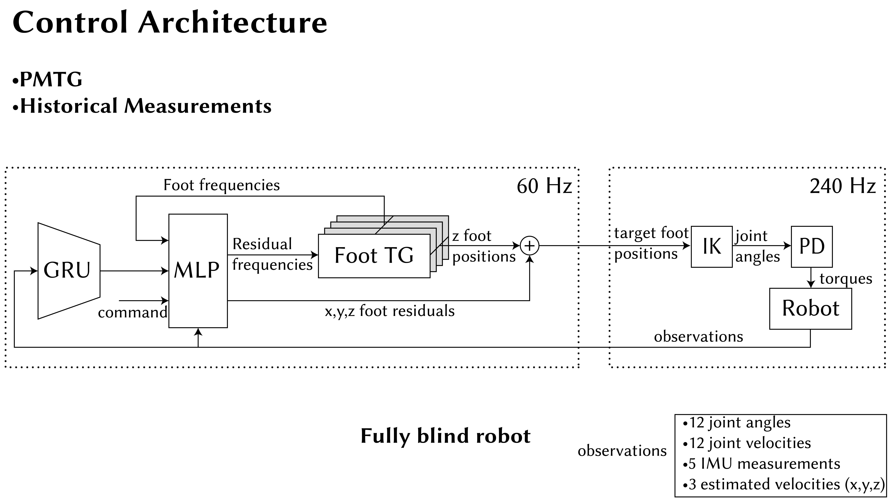
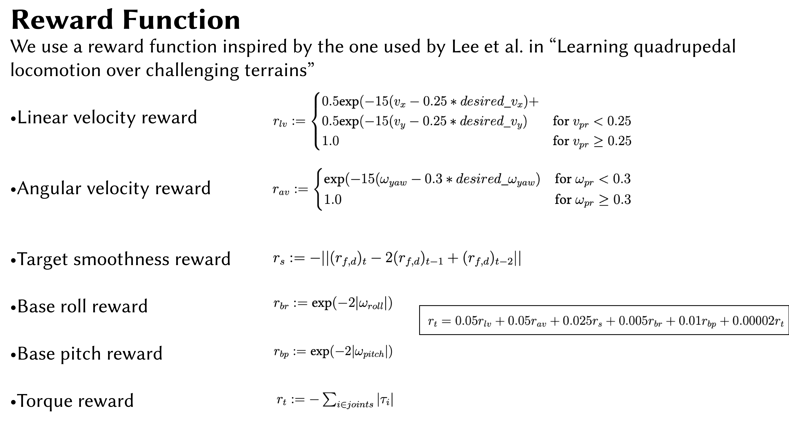
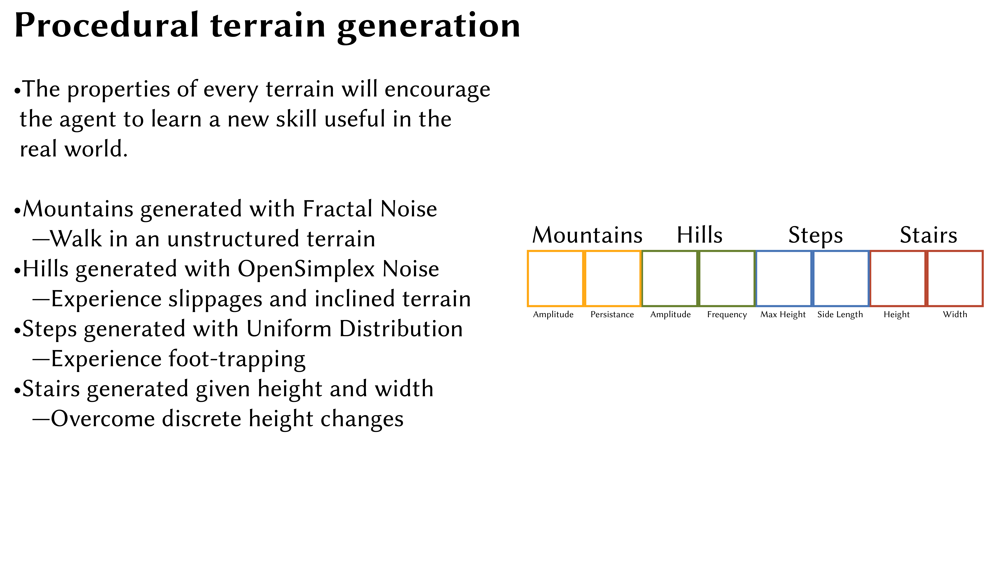
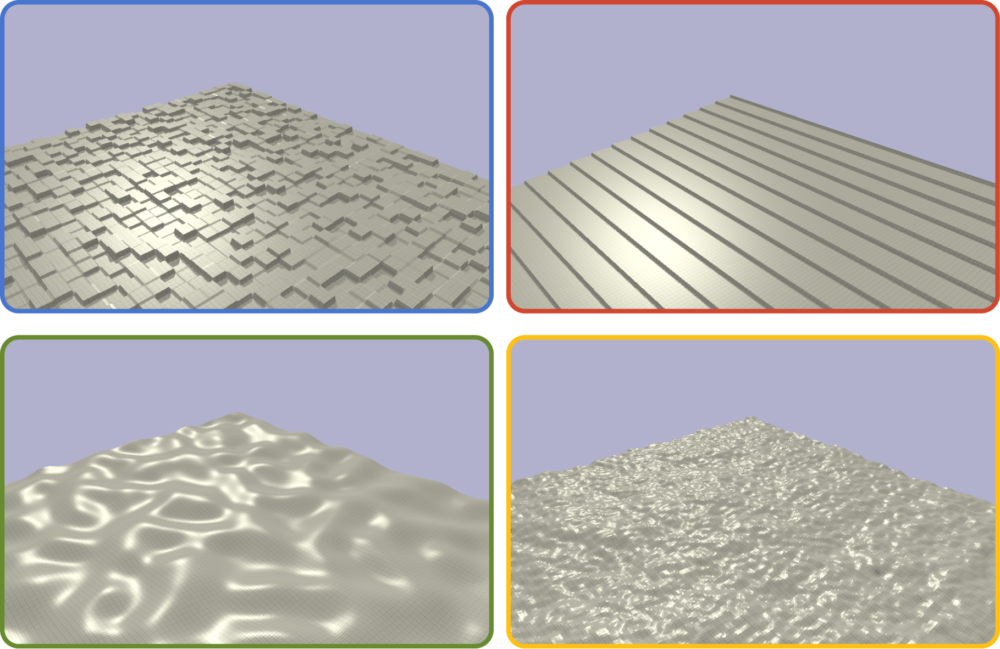
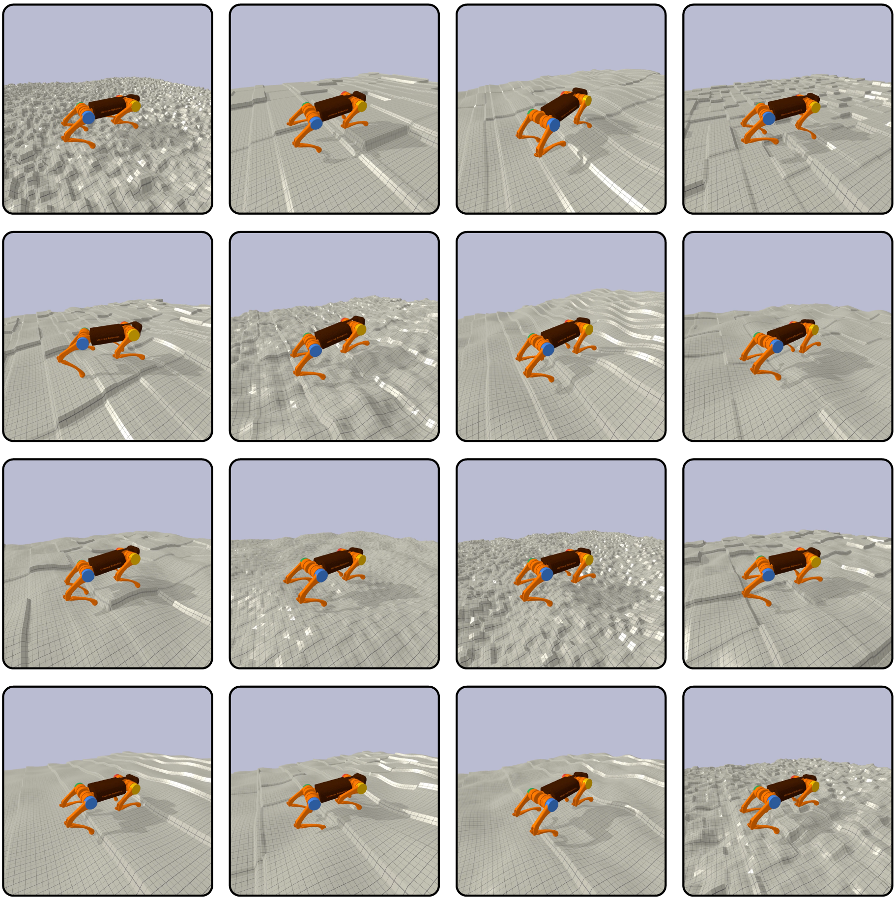

This is the code for the project:
"Curriculum Learning for Dynamic Robot Locomotion on Challenging Terrains" by Davide Paglieri, MSc student in Computing (AI & ML) at Imperial College London.

Quick overview of the project can be seen below. For more details check the full dissertation [here]()

•Control architecture, is based on PMTG and 

To visualise the experiments in video 2 of the appendix, you must install the following dependencies:

pip3 install pybullet
pip3 install absl-py
pip3 install numpy
pip3 install opensimplex

then run

python3 visualise_generalist.py