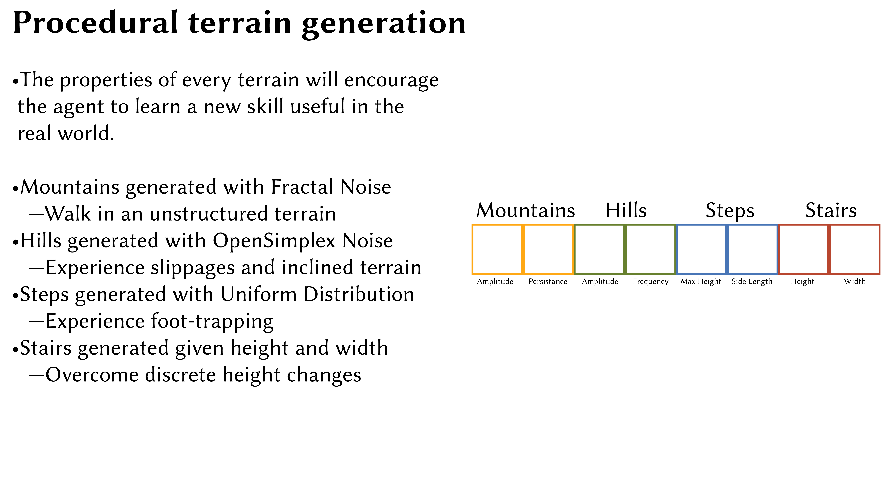
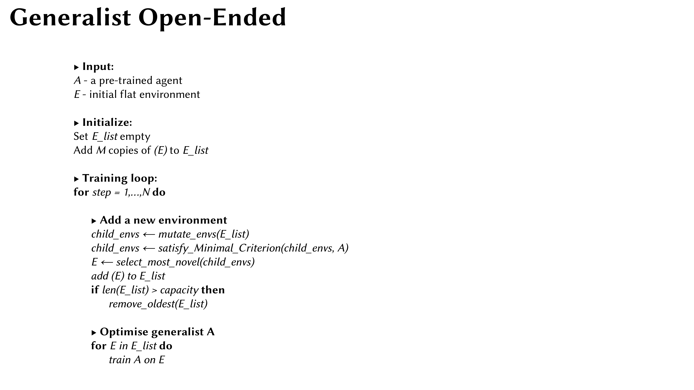
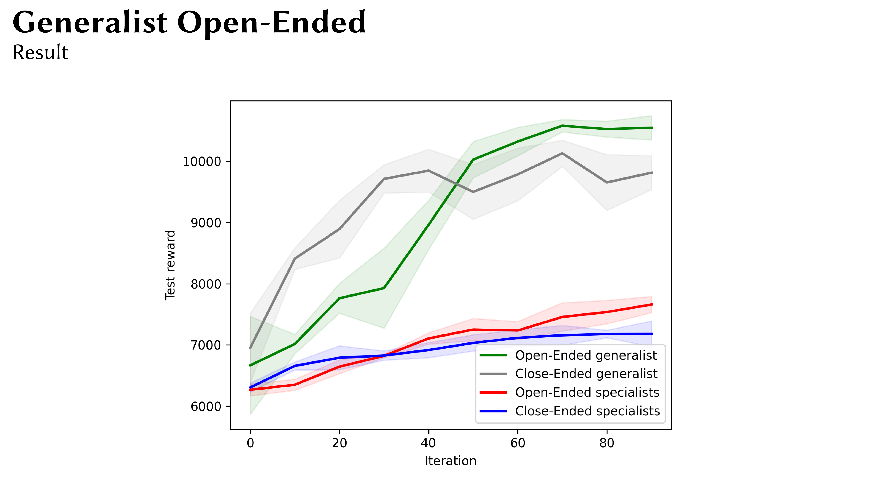

#Open-Ended Curriculum Learning for Dynamic Robot Locomotion

MSc individual project by Davide Paglieri at Imperial College London.

A quick overview of the control architecture, reward function, terrain generation, training algorithm and results can be seen below. Video of the deployed generalist robot can be found [here](https://www.youtube.com/watch?v=IE6DSlAliQ8) and [here](https://www.youtube.com/watch?v=PUApftlqQ_Y). For more details check the full dissertation [here](https://github.com/DavidePaglieri/Open_Ended_CL/blob/main/project_details/final_report.pdf). Sim2Real will be performed in the future to publish the work.

To visualise the fully blind robot trained with an open-ended curriculum, you must install the following dependencies:

pip3 install pybullet
pip3 install absl-py
pip3 install numpy
pip3 install opensimplex

clone the repository, then run

python3 visualise_generalist.py